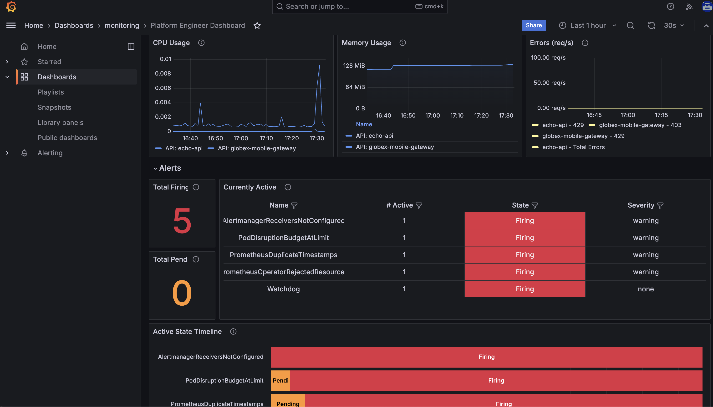

# Red Hat Connectivity Link

## Installation
Step 1: Ansible scripts for the deployment of connectivity link (Operators etc)

    cd operator-setup
    ansible-playbook playbooks/ocp4_workload_connectivity_link.yml -e ACTION=create -i inventories/inventory.template
    
Step 2: Demo setup

cd ../demo-setup
ansible-playbook playbooks/globex.yml -e ACTION=create -e "ocp4_workload_cloud_architecture_workshop_mobile_gateway_url=https://globex-mobile.globex.<ROUTE53_HOSTED_ZONE>"

** Tested on OpenShift 4.17.22

## RHCL Console

## Dashboards
https://grafana-route-monitoring.<OPENSHIFT_APPS_WILDCARD>/login

### Developer

### Platform Engineer

### Business User

